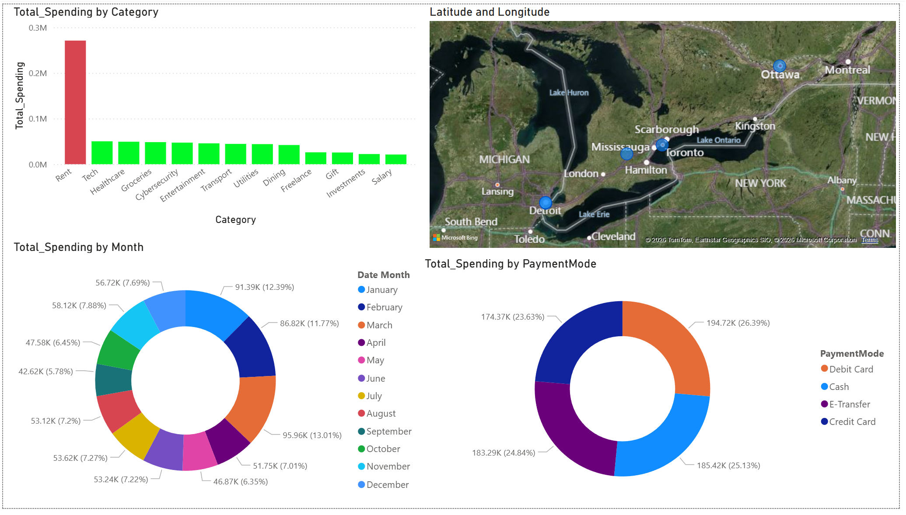
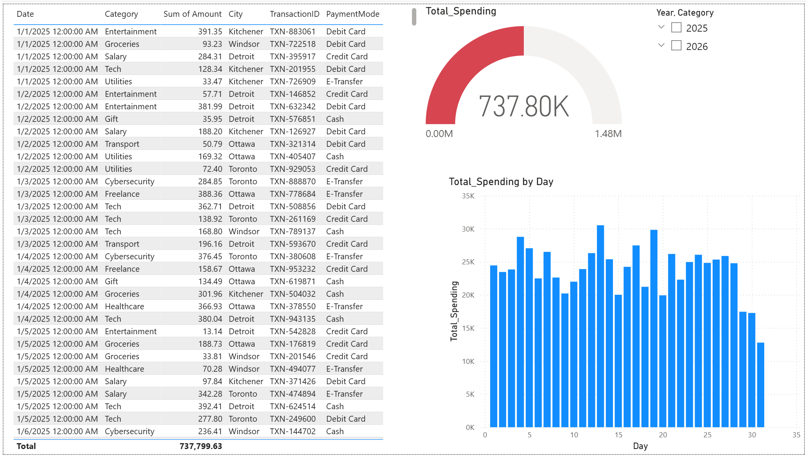

# End-to-End Financial Intelligence Pipeline
**SQL Server | Python ETL | Power BI Advanced Analytics**

## 📌 Project Overview
This repository showcases a professional data engineering and business intelligence pipeline. The project automates the generation of complex financial datasets, manages data persistence through a relational **SQL Server** backend, and delivers strategic insights via a high-performance **Power BI** dashboard.

By moving beyond static files, this architecture simulates a real-world enterprise environment where data flows from a scripted source into a data warehouse for robust reporting.

---

## 🏗️ Architecture & Data Flow
1. **Extraction & Generation (Python):** A custom Python ETL script generates ~2,500 rows of transactional data with realistic geographic distribution (Windsor, Toronto, Detroit, Kitchener, Ottawa).
2. **Storage & Persistence (SQL Server):** Using `SQLAlchemy` and `pyodbc`, the script performs a high-speed data load into a local **SQL Server (SSMS)** instance.
3. **Modeling (Star Schema):** Data is structured into a professional Star Schema within Power BI, utilizing a dedicated `Dim_Date` table for optimized performance.
4. **Analytics (DAX):** Advanced measures for Budget Variance, Month-over-Month (MoM) growth, and Cumulative "Burn Rate" analysis.

---

## 📊 Dashboard Preview

*Figure 1: Executive Summary showing YTD Spending and Budget Variance.*

*Figure 2: Transactional Audit page with Anomaly Detection and Burn Rate analysis.*

---

## 🛠️ Tech Stack
* **Python 3.x:** Pandas, SQLAlchemy, PyODBC (ETL & Data Engineering)
* **SQL Server (SSMS):** Enterprise-grade relational data storage
* **Power BI:** Advanced DAX modeling and interactive visualization
* **Data Modeling:** Star Schema (One-to-Many relationships)

---

## 🚀 Project Evolution

### Iteration 1 & 2: Foundations & Relational Modeling
* Generated synthetic financial data and architected a relational model.
* Established basic tracking for Income vs. Expenses and Geographic mapping.

### Iteration 3: SQL Data Engineering (Current Phase) 📍
* Migrated from flat CSV files to a **Live SQL Server** backend.
* Engineered a Python-to-SQL pipeline using batch inserts (`fast_executemany`) for performance.
* Implemented live data refresh capability in Power BI.

### Iteration 4: Data Quality & Cleaning (Planned)
* Simulating real-world "messy" data (nulls, duplicates, and inconsistent strings).
* Demonstrating advanced **Power Query** and **SQL** cleaning techniques.

### Iteration 5: Real-World Case Studies (Upcoming)
* Applying the pipeline to solve diverse business problems.
* Focusing on multi-industry scenarios including Finance, Marketing, and Operations.

---

## ⚙️ How it Works
The pipeline uses **SQL Server Express** as the central data hub.
* **Automation:** The Python script handles the creation of `Fact_Transactions` and `Fact_Budget` tables.
* **Direct Pipeline:** Power BI connects via **ODBC**, allowing for an instant dashboard refresh whenever new data is injected by the script.
* **Geographic Accuracy:** Specifically engineered latitude/longitude coordinates ensure pinpoint accuracy for map visuals across regional borders.

---

## 📖 How to Run This Project
1. **SQL Setup:** Create a database named `FinancePortfolioDB` in SQL Server Management Studio.
2. **Driver:** Install `ODBC Driver 17 for SQL Server`.
3. **Run ETL:** Execute `script/datagenerator.py` to populate the SQL tables.
4. **Connect PBIX:** Open the `.pbix` file and update the Data Source settings to point to your local SQL Server instance.

---

## 📂 Repository Structure
* `/script/datagenerator_sqlserver.py`: ETL script for data generation and SQL injection.
* `/images/`: High-resolution images of the dashboard.
* `Financial_Intelligence_V3.pbix`: The master Power BI dashboard file.
